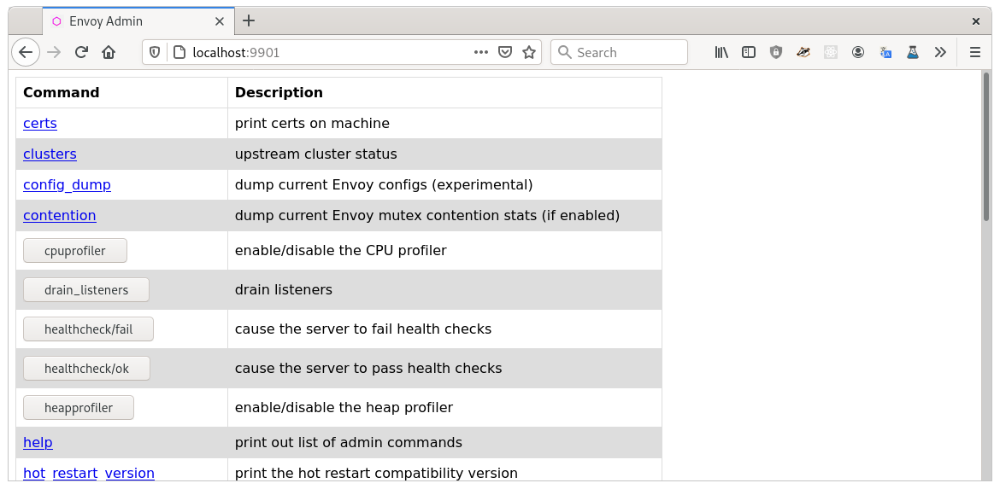

# Envoy

## Configuration

```sh
# 초기 구성 파일을 받아서 설정
docker run --rm envoyproxy/envoy:v1.23.0 cat /etc/envoy/envoy.yaml > envoy.yaml.example
```

## Envoy admin interface

- [docs](https://www.envoyproxy.io/docs/envoy/v1.23.0/start/quick-start/admin)


