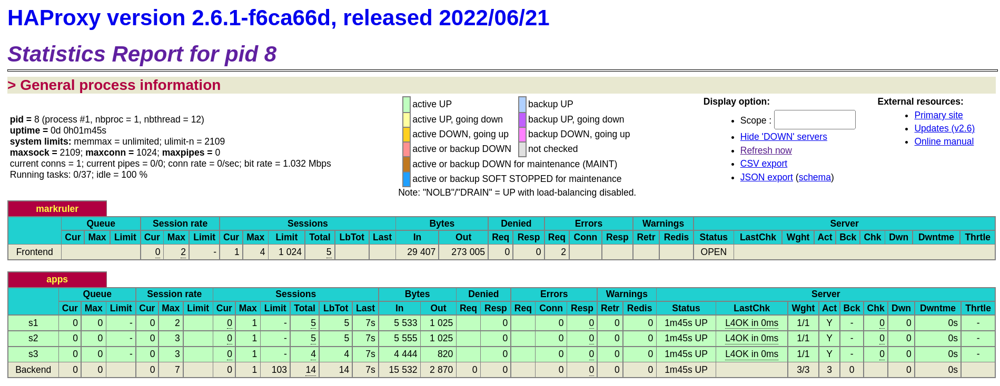

# HAProxy

## Configuration

```sh
# 초기 구성 파일 없음
# docker run --rm haproxy:2.6.1 cat /usr/local/etc/haproxy/haproxy.cfg > haproxy.cfg.example
```

## HAProxy statistics report

- [Exploring the HAProxy Stats Page](https://www.haproxy.com/blog/exploring-the-haproxy-stats-page/)

```cfg
frontend markruler
  bind *:80
  default_backend apps
  stats uri /stats
  stats refresh 10s
```



*http://localhost:8080/stats*

## 참조

- [HAProxy Configuration Basics: Load Balance Your Servers](https://www.haproxy.com/blog/haproxy-configuration-basics-load-balance-your-servers/) - HAProxy
- [How to Enable Health Checks in HAProxy](https://www.haproxy.com/blog/how-to-enable-health-checks-in-haproxy/) - HAProxy
- [Monitoring HAProxy performance metrics](https://www.datadoghq.com/blog/monitoring-haproxy-performance-metrics/) - Datadog
- [Circuit Breaking in HAProxy](https://www.haproxy.com/blog/circuit-breaking-haproxy/) - HAProxy
- [HAProxy Layer 7 Retries and Chaos Engineering](https://www.haproxy.com/blog/haproxy-layer-7-retries-and-chaos-engineering/) - HAProxy
- [Logging](https://www.haproxy.com/documentation/hapee/2-5r1/observability/logging/)
  - [Log with Docker](https://www.haproxy.com/documentation/hapee/2-5r1/observability/logging/log-with-docker/)
  - [Setting Log Levels](https://www.haproxy.com/documentation/hapee/2-5r1/observability/logging/log-level-setting/)
  - [Log Format for Access Logs](https://www.haproxy.com/documentation/hapee/2-5r1/observability/logging/log-formats/)
- [How to Map Domain Names to Backend Server Pools with HAProxy](https://www.haproxy.com/blog/how-to-map-domain-names-to-backend-server-pools-with-haproxy/)
- [Introduction to HAProxy Logging](https://www.haproxy.com/blog/introduction-to-haproxy-logging/)
  - [mminks/haproxy-docker-logging](https://github.com/mminks/haproxy-docker-logging)
  - CentOS 7에서는 동작하는데 Fedora 35에서는 동작하지 않는다. (원인 모름)
    ```sh
    rsyslog startup failure, child did not respond within startup timeout
    ```
