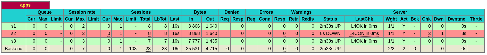
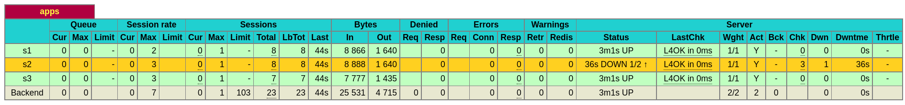
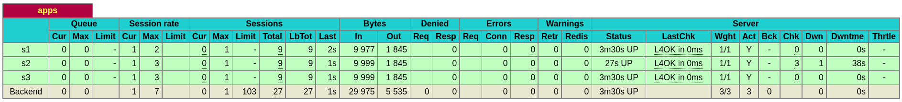
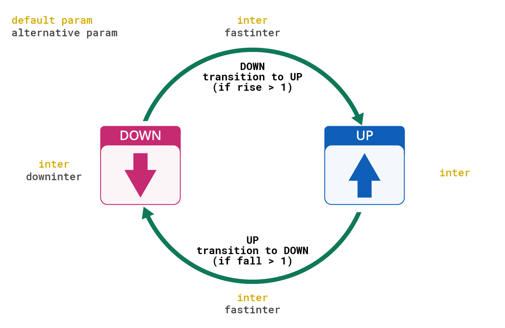

# Load Balancing

## 실행

```sh
# docker-compose up --build -d
docker-compose up -d
```

```sh
# header
curl localhost:8080 -I

# header + body
curl localhost:8080 -i
```

## Health Check 테스트

```sh
docker rm -f app2

curl localhost:8080
```

```sh
[WARNING]  (8) : Server apps/s2 is DOWN, reason: Layer4 timeout, check duration: 2000ms. 2 active and 0 backup servers left. 1 sessions active, 0 requeued, 0 remaining in queue.
```




```sh
docker run -d --rm -p 5002:5002 -e PORT=5002 --name app2 markruler/nodejs-hello-world
```

`app2` 라는 이름으로 재실행해도 연결하지 않는다.
Service Discovery가 없기 때문에 다시 찾지 못하는 것이다.
endpoint를 IP로 입력하면 헬스체크를 통해 자동으로 다시 연결할 수 있다.

```sh
[WARNING]  (8) : Server apps/s2 is UP, reason: Layer4 check passed, check duration: 0ms. 3 active and 0 backup servers online. 0 sessions requeued, 0 total in queue.
```





### Lifecycle



*[Active Health Checks](https://www.haproxy.com/documentation/hapee/2-5r1//load-balancing/health-checking/active-health-checks/) - HAProxy*

## 인스턴스 접근

```sh
docker exec -it slb sh
```

## 이슈

`option httpchk` 설정 시 기본적으로 `OPTIONS /` 경로로 헬스 체크한다.

```sh
curl -i -X OPTIONS ${HOST}:${PORT}
...
HTTP/1.1 200
...
```

HAProxy가
실행 중인 서버에서도 curl 요청 시 200 응답을 받아서
문제 없다고 판단하고 실행시켜봤지만 에러가 발생했다.

```sh
[NOTICE]   (1) : New worker (8) forked
[NOTICE]   (1) : Loading success.
Server be_server/s1 is DOWN, reason: Layer7 wrong status, code: 500, check duration: 4ms. 1 active and 0 backup servers left. 0 sessions active, 0 requeued, 0 remaining in queue.
[WARNING]  (8) : Server be_server/s1 is DOWN, reason: Layer7 wrong status, code: 500, check duration: 4ms. 1 active and 0 backup servers left. 0 sessions active, 0 requeued, 0 remaining in queue.
[WARNING]  (8) : Server be_server/s2 is DOWN, reason: Layer7 wrong status, code: 500, check duration: 3ms. 0 active and 0 backup servers left. 0 sessions active, 0 requeued, 0 remaining in queue.
[ALERT]    (8) : backend 'be_server' has no server available!
Server be_server/s2 is DOWN, reason: Layer7 wrong status, code: 500, check duration: 3ms. 0 active and 0 backup servers left. 0 sessions active, 0 requeued, 0 remaining in queue.
backend be_server has no server available!
```

문제는 Application 서버인 Tomcat에서 발생했다.
Servlet Filter에서 예외가 발생하다보니 Tomcat의 `localhost.log` 에 남았었다.

```sh
27-Jul-2022 16:27:18.313 심각 [http-nio-8090-exec-3] org.apache.catalina.core.StandardWrapperValve.invoke Servlet.service() for servlet [spring-web] in context with path [] threw exception
  java.lang.NullPointerException
    at com.autowini.m.common.security.filter.CustomRequestFilter.doFilterInternal(CustomRequestFilter.java:64)
    ...
```

### Layer4 connection problem

```sh
reason: Layer4 connection problem, info: "Host is unreachable at initial connection step of tcp-check", check duration: 3027ms.
```

```sh
> iptables -I INPUT -p tcp --dport 8080 -j ACCEPT
> iptables -nvL
Chain INPUT (policy ACCEPT 0 packets, 0 bytes)
    0     0 ACCEPT     tcp  --  *      *       0.0.0.0/0            0.0.0.0/0            state NEW tcp dpt:8080
```

### Layer7 timeout

```sh
reason: Layer7 timeout, check duration: 2001ms.
```

왜 2001ms 타임아웃이 발생했는지 아직 모르겠다.
아래는 실행시켰을때 기준 설정값이다.
재시작하니까 발생하지 않았다.
일시적인 문제일 수도 있다.

```conf
defaults
  timeout client 10s
  timeout connect 5s
  timeout server 10s
  timeout http-request 10s
```
