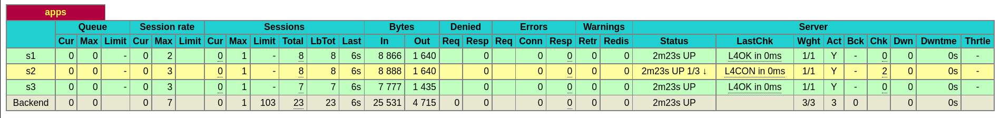

# Load Balancing

## 실행

```sh
docker-compose up
```

```sh
# header
curl localhost:8080 -I

# header + body
curl localhost:8080 -i
```

### Health Check 테스트

```sh
docker rm -f app2

curl localhost:8080
```

```sh
[WARNING]  (8) : Server apps/s2 is DOWN, reason: Layer4 timeout, check duration: 2000ms. 2 active and 0 backup servers left. 1 sessions active, 0 requeued, 0 remaining in queue.
```




```sh
docker run -d --rm -p 5002:5002 -e PORT=5002 --name app2 markruler/nodejs-hello-world
```

`app2` 라는 이름으로 재실행해도 연결하지 않는다.
Service Discovery가 없기 때문에 다시 찾지 못하는 것이다.
endpoint를 IP로 입력하면 헬스체크를 통해 자동으로 다시 연결할 수 있다.

```sh
[WARNING]  (8) : Server apps/s2 is UP, reason: Layer4 check passed, check duration: 0ms. 3 active and 0 backup servers online. 0 sessions requeued, 0 total in queue.
```


## 인스턴스 접근

```sh
docker exec -it slb sh
```

## 참조

- [Health checking](https://www.envoyproxy.io/docs/envoy/v1.23.0/intro/arch_overview/upstream/health_checking)
  - [docs source](https://github.com/envoyproxy/envoy/blob/v1.23.0/docs/root/intro/arch_overview/upstream/health_checking.rst)
- [Limiting Active Connections](https://www.envoyproxy.io/docs/envoy/v1.23.0/configuration/operations/overload_manager/overload_manager#limiting-active-connections)
  - `overload.global_downstream_max_connections`
- [Supported load balancers](https://www.envoyproxy.io/docs/envoy/v1.23.0/intro/arch_overview/upstream/load_balancing/load_balancers)
  - [Enum config.cluster.v3.Cluster.LbPolicy](https://www.envoyproxy.io/docs/envoy/v1.23.0/api-v3/config/cluster/v3/cluster.proto#envoy-v3-api-enum-config-cluster-v3-cluster-lbpolicy)
  - [load_balancing_policy](https://www.envoyproxy.io/docs/envoy/v1.23.0/api-v3/config/cluster/v3/cluster.proto#envoy-v3-api-field-config-cluster-v3-cluster-load-balancing-policy)
