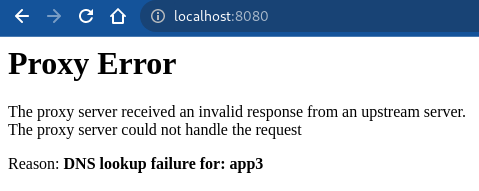

# Load Balancing

## httpd.conf

| Version                | Path                         |
| ---------------------- | ---------------------------- |
| RedHat, CentOS, Fedora | `/etc/httpd/conf/httpd.conf` |
| Ubuntu, Debian         | `/etc/apache2/apache2.conf`  |
| SLES                   | `/etc/apache2/httpd.conf`    |

```httpd.conf
LoadModule proxy_module modules/mod_proxy.so
LoadModule proxy_http_module modules/mod_proxy_http.so
LoadModule proxy_balancer_module modules/mod_proxy_balancer.so
LoadModule lbmethod_byrequests_module modules/mod_lbmethod_byrequests.so
LoadModule slotmem_shm_module modules/mod_slotmem_shm.so


<IfModule log_config_module>
    LogFormat "%h %l %u %t \"%r\" %>s %b \"%{BALANCER_WORKER_ROUTE}e\"" common
</IfModule>

ProxyHCExpr ok234 {%{REQUEST_STATUS} =~ /^[234]/}

<Proxy "balancer://markruler-cluster">
    BalancerMember "http://app1:5001" route=app1 hcmethod=HEAD hcexpr=ok234 hcinterval=2
    BalancerMember "http://app2:5002" route=app2 hcmethod=HEAD hcexpr=ok234 hcinterval=2
    BalancerMember "http://app3:5003" route=app3 hcmethod=HEAD hcexpr=ok234 hcinterval=2
</Proxy>

ProxyPass        "/" "balancer://markruler-cluster"
ProxyPassReverse "/" "balancer://markruler-cluster"
```

## 실행

```sh
docker-compose up
```

```sh
# header
curl localhost:8080 -I

# header + body
curl localhost:8080 -i
```

```sh
# BALANCER_WORKER_ROUTE 변수를 사용하면 선택된 route를 확인할 수 있다.
192.168.208.1 - - [18/Jul/2022:02:12:33 +0000] "GET / HTTP/1.1" 200 29 "app1"
192.168.208.1 - - [18/Jul/2022:02:12:34 +0000] "GET / HTTP/1.1" 200 29 "app2"
192.168.208.1 - - [18/Jul/2022:02:12:34 +0000] "GET / HTTP/1.1" 200 29 "app3"
```

### Health Check 테스트

```sh
docker rm -f app3
```



*앱을 강제 종료하고 헬스체크하는 사이에 접근 시도할 경우 Proxy Error*

- TCP Proxy도 제공되지만 웹 서비스 사용자 입장에선 HTTP 응답이 중요하다.

## 인스턴스 접근

```sh
docker exec -it slb sh
```

## CentOS 7

CentOS 7에서는 2.4.6 이상 버전으로 업데이트할 수 없다.

```sh
> httpd -v
Server version: Apache/2.4.6 (CentOS)
Server built:   Apr 24 2019 13:45:48

> yum update httpd

> httpd -v
Server version: Apache/2.4.6 (CentOS)
Server built:   Mar 24 2022 14:57:57
```

`mod_proxy_hcheck` 모듈을 사용하기 위해서는
[2.4.21 이상 버전이 필요](https://httpd.apache.org/docs/2.4/mod/mod_proxy_hcheck.html)하다.
docker를 이용해서 사용하자.

```sh
> yum update
Retrieving key from file:///etc/pki/rpm-gpg/RPM-GPG-KEY-EPEL-7
Importing GPG key 0x352C64E5:
 Userid     : "Fedora EPEL (7) <epel@fedoraproject.org>"
 Fingerprint: 91e9 7d7c 4a5e 96f1 7f3e 888f 6a2f aea2 352c 64e5
 Package    : epel-release-7-11.noarch (@extras)
 From       : /etc/pki/rpm-gpg/RPM-GPG-KEY-EPEL-7
Is this ok [y/N]: y
Retrieving key from https://yum.datadoghq.com/DATADOG_RPM_KEY.public
Retrieving key from https://yum.datadoghq.com/DATADOG_RPM_KEY_E09422B3.public


The GPG keys listed for the "Datadog, Inc." repository are already installed but they are not correct for this package.
Check that the correct key URLs are configured for this repository.


 Failing package is: 1:datadog-agent-6.38.0-1.x86_64
 GPG Keys are configured as: https://yum.datadoghq.com/DATADOG_RPM_KEY.public, https://yum.datadoghq.com/DATADOG_RPM_KEY_E09422B3.public
```

;;; [공식 문서](https://docs.datadoghq.com/agent/guide/linux-agent-2022-key-rotation/?tab=redhatcentossuse) 참고...

```sh
> curl -o /tmp/DATADOG_RPM_KEY_FD4BF915 https://keys.datadoghq.com/DATADOG_RPM_KEY_FD4BF915.public
> sudo rpm --import /tmp/DATADOG_RPM_KEY_FD4BF915
```

## 참조

- [Apache Module mod_proxy](https://httpd.apache.org/docs/trunk/mod/mod_proxy.html)
  - [Apache Module mod_proxy_http](https://httpd.apache.org/docs/2.4/mod/mod_proxy_http.html)
  - [Apache Module mod_proxy_balancer](https://httpd.apache.org/docs/2.4/mod/mod_proxy_balancer.html)
  - Load balancer scheduler algorithms
    - [mod_lbmethod_byrequests](https://httpd.apache.org/docs/trunk/mod/mod_lbmethod_byrequests.html): Request Counting
    - [mod_lbmethod_bytraffic](https://httpd.apache.org/docs/trunk/mod/mod_lbmethod_bytraffic.html): Weighted Traffic Counting
    - [mod_lbmethod_bybusyness](https://httpd.apache.org/docs/trunk/mod/mod_lbmethod_bybusyness.html): Pending Request Counting
    - [mod_lbmethod_heartbeat](https://httpd.apache.org/docs/trunk/mod/mod_lbmethod_heartbeat.html): Heartbeat Traffic Counting
  - [mod_proxy_hcheck](https://httpd.apache.org/docs/2.4/mod/mod_proxy_hcheck.html)
    - [mod_watchdog](https://httpd.apache.org/docs/2.4/mod/mod_watchdog.html)
- [mod_slotmem_shm](https://httpd.apache.org/docs/trunk/mod/mod_slotmem_shm.html) : Slot-based shared memory provider
- [Apache HTTP Server 2.4 설명서 (한국어)](https://runebook.dev/ko/docs/apache_http_server/)
