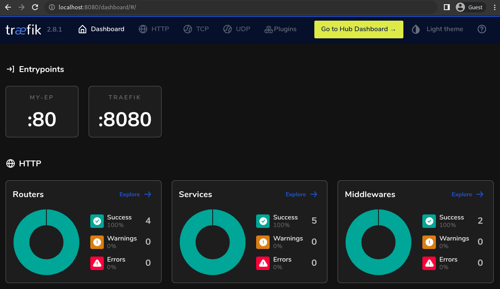

# HAProxy

## Configuration

```sh
# 초기 구성 파일을 받아서 설정할 수 없음
# docker run --rm traefik:v2.8.1 -h
```

```sh
# entrypoint가 traefik cli 커맨드
# entrypoint.sh
#!/bin/sh
set -e

# first arg is `-f` or `--some-option`
if [ "${1#-}" != "$1" ]; then
    set -- traefik "$@"
fi

# if our command is a valid Traefik subcommand, let's invoke it through Traefik instead
# (this allows for "docker run traefik version", etc)
if traefik "$1" --help >/dev/null 2>&1
then
    set -- traefik "$@"
else
    echo "= '$1' is not a Traefik command: assuming shell execution." 1>&2
fi

exec "$@"
```

## Traefik Dashboard

```toml
[api]
insecure = true # http
dashboard = true
```



*[Dashboard](https://doc.traefik.io/traefik/operations/dashboard/)*

## 참조

- [docs](https://doc.traefik.io/traefik/)
